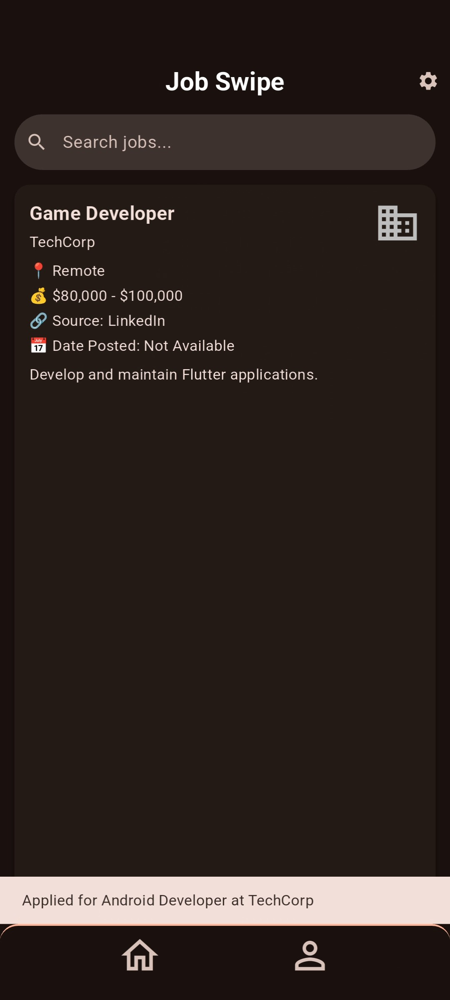
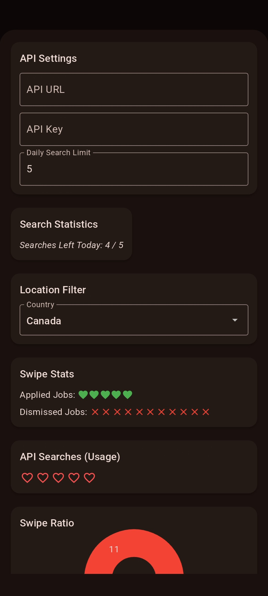
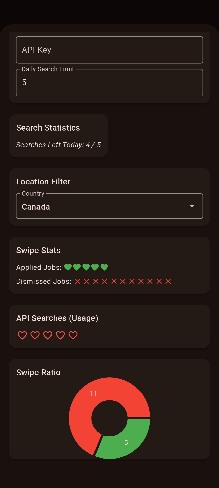
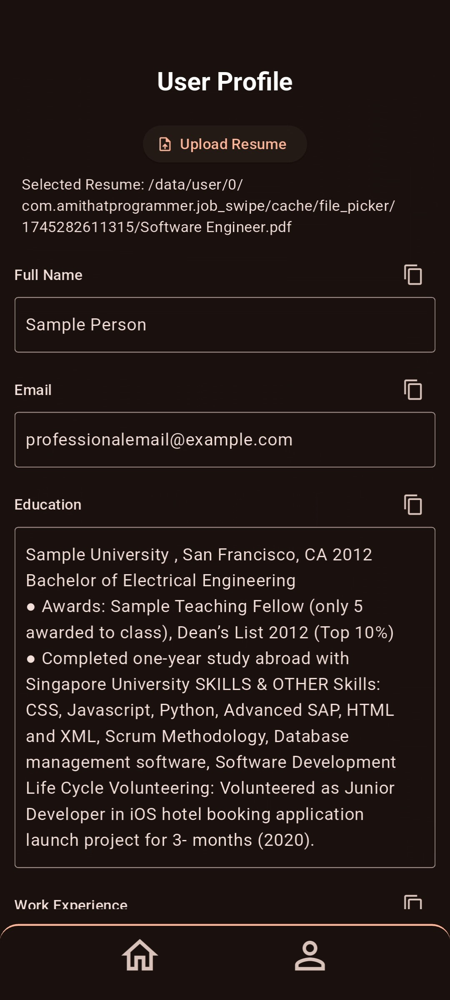

# 🚀 Flutter Job Application App
A mobile app that allows users to browse and apply for jobs using a Tinder-style swipe interface. Users can swipe through job listings, upload and parse their resumes, and manage a detailed professional profile.

---

## 📸 Screenshots

<div align="center">
  <table>
    <tr>
      <td></td>
      <td></td>
    </tr>
    <tr>
      <td></td>
      <td></td>
    </tr>
  </table>
</div>

---

---

## 📌 Features

### 🔥 Job Search & Swipe UI
- **Search Bar** – Filter job listings by job title, location, or keywords.
- **Job Cards** – Show job title, company logo, description, and link.
- **Swipe Actions**:
  - **Swipe Left** – Discards the job (excluded from stats).
  - **Swipe Right** – Opens the job posting URL directly (no auto-fill).
  - **Tap-to-Expand** – *(In development)* View full job details.

### 🌐 Custom Job API Input
- **User-Provided API** – Input your own API URL and key.
- **Search Limit Control** – Avoid exhausting free-tier limits.
- **Flexible Formatting** – API response parser ensures consistent job cards.

### 📈 Interaction Statistics
- Tracks user engagement:
  - Total swipes.
  - Swipes left.
  - Swipes right.

### 🏠 Profile & Resume Management
- **User Profile** – Edit personal info, work history, and education.
  - Name
  - Work Experience (title, duration, description)
  - Education (institute, degree, year)
- **Resume Upload** – Accepts PDF, DOC, and standard formats.
- **Resume Parsing & Editing** – Parsed resume shown in editable format for review and copy-paste.

### 📂 Local Storage
- **Secure Storage** – Profile and resume stored locally via SQLite or Shared Preferences.
- **Swipe Tracking** – *(Planned)* No caching or local history yet.

### 🎨 UI & Animations
- Built with **Material Design 3**.
- Smooth swipe gestures and transitions.
- Fully supports **Dark Mode**.

### 🛠️ Additional Features
- **Settings Panel** – Customize API keys, control search limits, toggle filters.
- **Robust Error Handling** – Graceful degradation on network/API failure.
- **Security** – All personal data is stored securely on-device.
- **Job History** – *(Planned)* Add access to previous swipes and favorites.

---

## 📌 Tech Stack
- **Flutter SDK** – Cross-platform UI toolkit.
- **Dart** – Application logic and UI code.
- **SQLite / Shared Preferences** – Local persistence.
- **Dio / HTTP** – Networking layer.
- **Flutter Animations** – UI transitions and swipe effects.

---

## 🏗️ Project Setup

### 🔧 Prerequisites
Ensure you have:
- Flutter SDK
- Dart
- Android Studio or VS Code (with Flutter plugin)
- Git

### 🚀 Clone the Repository
```bash
git clone https://github.com/agamairi/job-swipe.git
cd job-application-app
```

### 📦 Install Dependencies
```bash
flutter pub get
```

### 🔨 Run the App
```bash
flutter run
```

---

## 🔥 Features in Development
- Tap-to-Expand Job Details
- Improved Resume Parsing
- Job History & Favorites

---

## 🚀 Contributing
Want to contribute? Fork the repo, create a new branch, and submit a pull request!

---

## 🛠️ Troubleshooting

### 🔴 App Fails to Start
- Ensure dependencies are installed:
```bash
flutter pub get
```
- Check Flutter version:
```bash
flutter --version
```

### 🔴 Jobs Not Loading
- Verify internet connectivity.
- Check your custom API URL and key.
- Run in verbose mode:
```bash
flutter run --verbose
```

---

## 📜 License
MIT License – use freely with attribution.

## 📞 Contact
For questions, feedback, or contributions, open an issue on GitHub.

