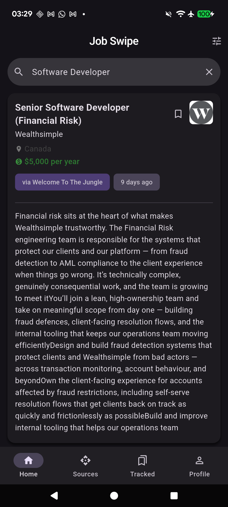
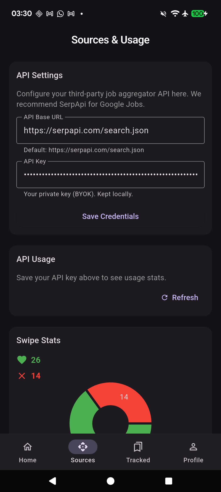
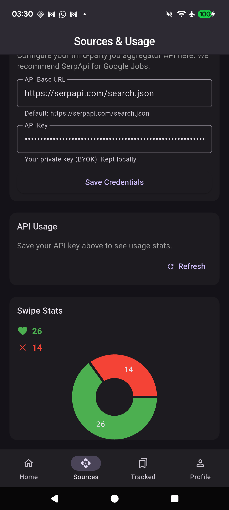
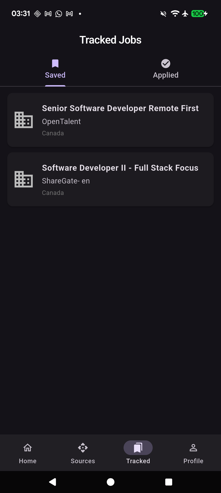
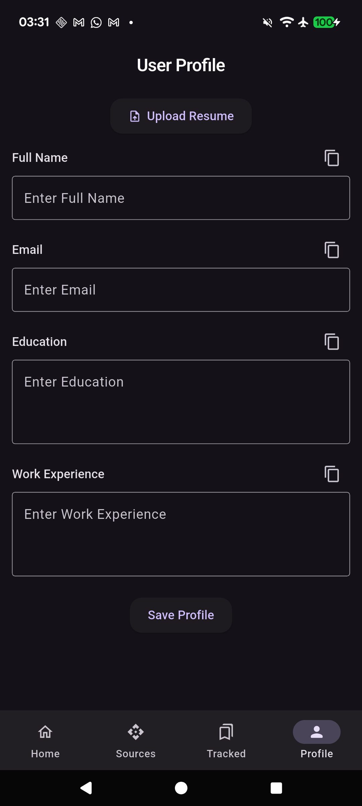

# 🚀 Flutter Job Application App
A mobile app that allows users to browse and apply for jobs using a Tinder-style swipe interface. Users can swipe through job listings, upload and parse their resumes, and manage a detailed professional profile.

---

## 📸 Screenshots

<div align="center">
  <table>
    <tr>
      <td><b>1. Home Screen</b></td>
      <td><b>2. API Config & Settings</b></td>
      <td><b>3. Swipe Analytics Dashboard</b></td>
    </tr>
    <tr>
      <td></td>
      <td></td>
      <td></td>
    </tr>
    <tr>
      <td><b>4. Tracked Jobs (Saved/Applied)</b></td>
      <td colspan="2" align="center"><b>5. Profile & Resume Parser</b></td>
    </tr>
    <tr>
      <td></td>
      <td colspan="2" align="center"></td>
    </tr>
  </table>
</div>

---

## 📌 Features

### 🔥 Job Search & Swipe UI
- **Search Bar** – Filter job listings by job title, location, or keywords.
- **Job Cards** – Show job title, company logo, salary, description, and source metadata.
- **Swipe Actions**:
  - **Swipe Left** – Discards the job (persisted in SQLite, excluded from future searches).
  - **Swipe Right** – Launches the in-app default browser to the job posting URL (saving/applying the job).
  - **Tap Card** – Open the full job details on a dedicated details screen.

### 🗄️ Local Database Caching & History (SQLite)
- **Search Caching** – Search results are cached locally in SQLite. Caches expire automatically after 24 hours or when all retrieved jobs are swiped.
- **State Retention** – The app stores already seen, saved, and discarded jobs. Tapping back, closing, or reopening the app will never present you with duplicate job cards or jobs you have already swiped.

### 📂 Tracked Jobs Management
- **Saved & Applied Tabs** – Access jobs in two piles inside the **Tracked** screen.
- **Job Details View** – Tapping a saved or applied job opens a custom detailed page displaying the job's title, company logo, description, and metadata.
- **Save-to-Apply Conversion** – Tapping "Apply Now" from your **Saved** list transitions the job to the **Applied** list automatically.
- **Export to CSV** – A download action on the **Applied** tab exports all applied jobs (job title, link, company, salary, location) to a CSV file and opens the native share sheet.

### 🌐 Native Default Browser Integration
- **Custom In-App Browsing** – Integrates `url_launcher` utilizing native Android Custom Tabs & iOS Safari View Controller.
- **Safe & Feature-Rich** – Retains all features of your default browser (autofill, passwords, Google Sign-in, navigation history) while keeping you inside the app loop.

### 🏠 Profile & Resume Management
- **User Profile** – Edit personal info, work history, and education.
- **Resume Upload** – Upload resumes (PDF, Word formats).
- **Resume Parsing & Editing** – Parsed content automatically fills out the education and work history forms for review.

### 🎨 UI & Animations
- Built with **Material Design 3**.
- Smooth deck swipe gestures, bookmark transitions, and tab animations.
- Full dark mode and custom launcher branding icons for iOS and Android.

---

## 📌 Tech Stack
- **Flutter SDK** – Cross-platform UI toolkit.
- **Dart** – Logic and user interface.
- **SQLite / SharedPreferences** – Local data storage and session state.
- **Dio / HTTP** – Network APIs.
- **fl_chart** – Statistics analytics dashboard rendering.

---

## 🏗️ Project Setup

### 🔧 Prerequisites
Ensure you have:
- Flutter SDK (3.32.5+)
- Dart
- Android Studio / Xcode (with simulators/connected debug devices)
- Git

### 🚀 Clone the Repository
```bash
git clone https://github.com/agamairi/job-swipe.git
cd job-swipe
```

### 📦 Install Dependencies
```bash
flutter pub get
```

### 🔨 Run the App
```bash
flutter run
```

---

## 🔥 Features in Development
- AI-based job match recommendations.
- Remote profile synchronization.

---

## 🚀 Contributing
Want to contribute? Fork the repo, create a new branch, and submit a pull request!

---

## 📜 License
MIT License – use freely with attribution.

## 📞 Contact
For questions, feedback, or contributions, open an issue on GitHub.


